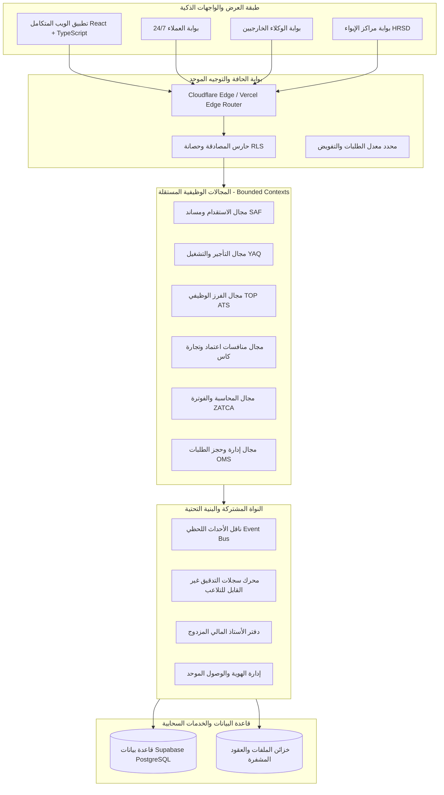
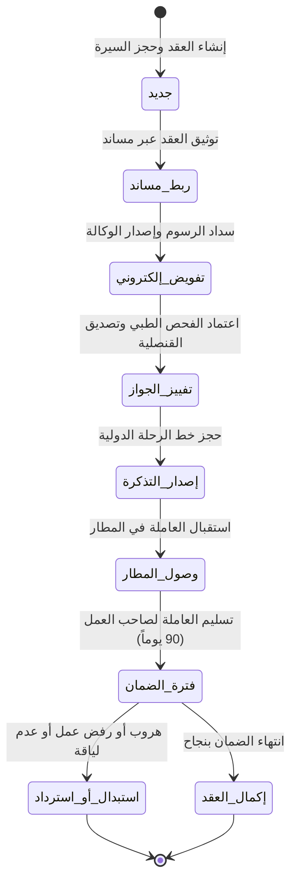

# الميثاق المعماري المؤسسي الشامل (Enterprise Architecture Blueprint)
## منظومة ERP مجموعة خالد السليم القابضة
### Modular Architecture • DDD • State Machines • EDA • Idempotency • RBAC • Multi-Tenancy • OMS • Inventory • Payments • Ledger • Settlement • Dispatch • Real-Time • Audit • Observability

---

### 1. العمارة المعيارية والطبقات المؤسسية (Modular Architecture Topology)

تتبنى المنظومة نموذج **العمارة المعيارية الموجهة للمجالات (Modular Monolith / Modular Architecture)**، حيث ينقسم النظام إلى حزم مستقلة وظيفياً تشترك في نواة نظام موحدة (Shared Kernel)، مما يحقق أعلى درجات الفصل والتماسك مع سهولة الصيانة والتطوير المتوازي:



---

### 2. التصميم الموجه بالمجال (Domain-Driven Design - DDD)

#### 2.1. سياقات الحدود المحصورة (Bounded Contexts)
1. **RecruitmentContext (سياق الاستقدام)**: يدير دورة حياة استقدام العمالة المنزلية من الفلبين، إندونيسيا، كينيا، وغيرها عبر الربط المباشر مع منصة مساند.
2. **RentalContext (سياق التأجير والتشغيل)**: يدير باقات التأجير بالساعة، اليوم، والشهر، وجدولة وتسكين العمالة.
3. **ATSContext (سياق الفرز والتوظيف)**: يدير بنك السير الذاتية، الفرز الذكي، وتسكين الوظائف التخصصية.
4. **TenderContext (سياق المنافسات واعتماد)**: تفكيك وتحليل وتتبع منافسات منصة اعتماد وحساب جداول الكميات (BOQ).
5. **FinanceContext (سياق المالية والزكاة)**: القيود المحاسبية، ومراكز التكلفة، والفوترة الإلكترونية (ZATCA Phase 2).
6. **ShelterContext (سياق مراكز الإيواء)**: استقبال وتسكين ورعاية العمالة التائهة أو المنتهية عقودها وفق لوائح وزارة الموارد البشرية.

#### 2.2. الكيانات والجذور التجميعية (Aggregates & Entities)
```typescript
// الجذر التجميعي لعقد الاستقدام (Recruitment Contract Aggregate Root)
export class RecruitmentContractAggregate {
  private constructor(
    public readonly id: ContractId,
    public readonly companyId: CompanyId,
    private client: ClientReference,
    private candidate: CandidateDetails,
    private stage: ContractStage,
    private financialStatus: FinancialStatus,
    private warrantyPeriod: WarrantyPolicy,
    private domainEvents: DomainEvent[] = []
  ) {}

  // عملية انتقال مضبوطة بشروط المجال
  public transitionToVisaStamping(visaNumber: string, embassyReceipt: string): Result<void> {
    if (this.stage !== ContractStage.AGENCY_DELEGATED) {
      return Result.fail('لا يمكن الانتقال للتفييز دون إتمام التفويض الإلكتروني المعتمد');
    }
    this.stage = ContractStage.VISA_STAMPED;
    this.addDomainEvent(new VisaStampedEvent(this.id, visaNumber, new Date()));
    return Result.ok();
  }
}
```

---

### 3. آلات الحالة المنتهية الموجهة للعمليات (State Machines & Lifecycle Automation)

تخضع كافة الكيانات التشغيلية الحساسة لآلات حالة منتهية حتمية تمنع أي تغيير غير شرعي:



---

### 4. العمارة الموجهة بالأحداث (Event-Driven Architecture - EDA)

#### 4.1. نمط صندوق الصادر المالي الآمن (Transactional Outbox Pattern)
لضمان عدم حدوث تضارب بين كتابة المعاملة في قاعدة البيانات ونشر الحدث في ناقل الأحداث، تعتمد المنظومة نمط الـ Outbox داخل نفس المعاملة (Database Transaction):
```sql
BEGIN;
  -- 1. تحديث سجل العقد
  UPDATE recruitment_contracts 
  SET stage = 'وصول', updated_at = NOW() 
  WHERE id = 'CTR-8921';

  -- 2. إدراج حدث النطاق داخل صندوق الصادر
  INSERT INTO domain_outbox_events (
    event_id, 
    aggregate_type, 
    aggregate_id, 
    event_type, 
    payload, 
    created_at
  ) VALUES (
    gen_random_uuid(), 
    'RecruitmentContract', 
    'CTR-8921', 
    'ContractArrivalConfirmed', 
    '{"contractId": "CTR-8921", "warrantyDays": 90, "notifiedClient": true}', 
    NOW()
  );
COMMIT;
```

---

### 5. حوكمة العمليات التكرارية وحصانة التكرار (Idempotency & Concurrency)

#### 5.1. مفاتيح عدم التكرار (Idempotency-Key Protocol)
- يُلزم كل طلب مالي (دفع، إصدار فاتورة، حجز باقة) بإرسال رأس `Idempotency-Key`:
```typescript
export async function processPaymentWithIdempotency(
  idempotencyKey: string,
  paymentPayload: PaymentRequest
): Promise<PaymentResponse> {
  // فحص ما إذا كانت المعاملة قد نُفذت مسبقاً
  const existing = await db.idempotencyRecords.find(idempotencyKey);
  if (existing) {
    return existing.cachedResponse; // إرجاع نفس الاستجابة دون إعادة خصم المبلغ
  }

  // تنفيذ الخصم الآمن
  const result = await executePaymentGateway(paymentPayload);
  await db.idempotencyRecords.save(idempotencyKey, result);
  return result;
}
```

---

### 6. نظام إدارة الطلبات وحجز المخزون (OMS & Inventory Reservation)

#### 6.1. منع الحجز المزدوج (Double-Booking Elimination via Leases)
عند رغبة عميل في حجز سيرة ذاتية أو باقة تأجير عاملة:
1. يتم منح العميل **قفل حجز زمني مدته 15 دقيقة (15-Minute Soft Lease Lock)** باستخدام القفل المتشائم في قاعدة البيانات (`SELECT ... FOR UPDATE`).
2. تظهر السيرة الذاتية لباقي العملاء بالحالة "محجوزة مؤقتاً للتثبيت".
3. إذا أتم العميل الدفع خلال 15 دقيقة، يتحول الحجز إلى دائم (`Hard Committed`).
4. إذا انتهت المهلة دون دفع، تنتهي صلاحية القفل تلقائياً وتعود السيرة للمخزون المتاح عبر مشغل زمني.

---

### 7. تنسيق المدفوعات ودفتر الأستاذ المالي المزدوج (Payment Orchestration & Ledger)

#### 7.1. موجه بوابات الدفع الوطنية (Payment Orchestrator)
- دعم موحد لبوابات: **Moyasar**, **HyperPay**, و **Geidea** مع دعم فوري لـ **Apple Pay** و **مدى**.
- التحقق الرياضي الصارم من توقيع الـ Webhook (HMAC-SHA256) قبل تأكيد أي حوالة مالية.

#### 7.2. دفتر الأستاذ المزدوج غير القابل للتعديل (Immutable Double-Entry Ledger)
كل حركة مالية تُسجل في قيد يومية متوازن يضمن التطابق التام:
$$\sum \text{Debit} = \sum \text{Credit}$$

```sql
-- جدول قيود اليومية المحاسبية الموحدة
CREATE TABLE accounting_journal_entries (
  id UUID PRIMARY KEY DEFAULT gen_random_uuid(),
  company_id VARCHAR(10) NOT NULL,
  entry_number VARCHAR(50) NOT NULL UNIQUE,
  entry_date TIMESTAMP WITH TIME ZONE DEFAULT NOW(),
  description TEXT NOT NULL,
  total_debit NUMERIC(15, 2) NOT NULL,
  total_credit NUMERIC(15, 2) NOT NULL,
  created_by UUID REFERENCES auth.users(id),
  CONSTRAINT chk_balanced_entry CHECK (total_debit = total_credit)
);
```

---

### 8. خوارزميات التسوية والتوزيع الميداني (Settlement & Dispatch Operations)

#### 8.1. تسوية مستحقات الوكلاء الخارجيين وحسابات الضمان (Escrow Settlement)
- حفظ أموال الاستقدام في حساب وسيط (Escrow Account) حتى وصول العاملة واجتياز الفحص الطبي.
- احتساب العمولات وصرف المستحقات تلقائياً للوكيل الخارجي وفق اتفاقية تقاسم الإيرادات المعتمدة.

#### 8.2. محرك التوزيع وتوجيه الأسطول (Intelligent Dispatch Engine)
- جدولة وتوزيع رحلات سائقي شركة الياقوت الشرقية استناداً إلى:
  - الموقع الجغرافي للمستفيد (Geofencing & Coordinate Clustering).
  - مواعيد مناوبات العمالة وتفضيلات العملاء (صباحي / مسائي).
  - الحالة المرورية وحساب المسار الأمثل لتقليل استهلاك الوقود.

---

### 9. الأحداث اللحظية والمراقبة والرصد الشامل (Real-Time Events & Observability)

#### 9.1. اتصالات الويب اللحظية (Supabase Realtime WebSockets)
- بث لحظي للإشعارات عبر قنوات خاصة مشفرة:
  - `tenant:[company_id]:orders`
  - `contract:[contract_id]:milestones`
- إشعارات فورية لفرق العمليات بمجرد تحديث مساند أو اكتمال الفحص الطبي دون الحاجة لإعادة تحميل الشاشة.

#### 9.2. سجلات التدقيق غير القابلة للتلاعب (Cryptographic Audit Trail)
- تسجيل كافة الإجراءات مع البصمة الرقمية للمستخدم، وتوقيت الخادم، وعنوان الـ IP.
- منع استخدام أوامر `UPDATE` أو `DELETE` على جدول سجلات التدقيق لمنع التغطية على أي تجاوز.

#### 9.3. المرصد التشغيلي والتتبع الموزع (Observability & OpenTelemetry)
- مراقبة الأخطاء لحظياً بواسطة **Sentry** مع تصنيف التنبيهات حسب الأولوية.
- قياس أداء استعلامات قواعد البيانات والـ API Latency لضمان الالتزام بميثاق الـ SLOs (p95 < 250ms).
- صفحة فحص سلامة المنظومة المباشرة: `GET /api/health` للتحقق من الاتصال بقاعدة البيانات، ومجمّع Supavisor، وبوابات الدفع الحكومية.
